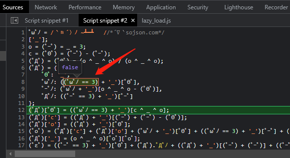
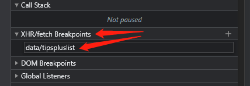
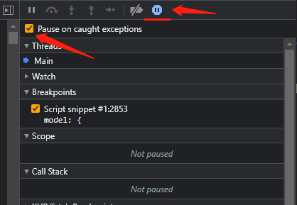
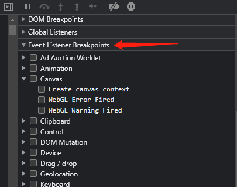
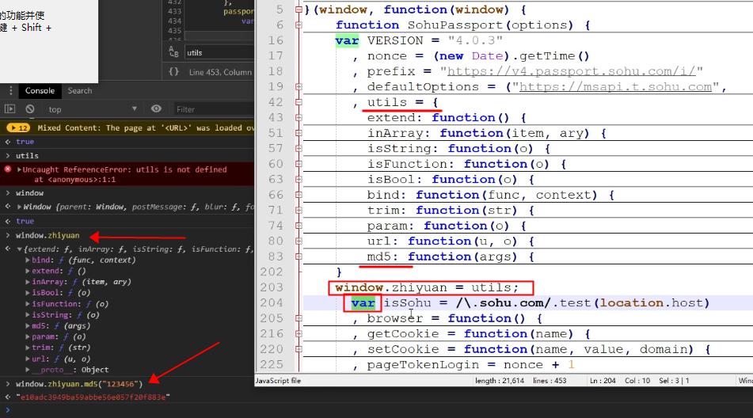
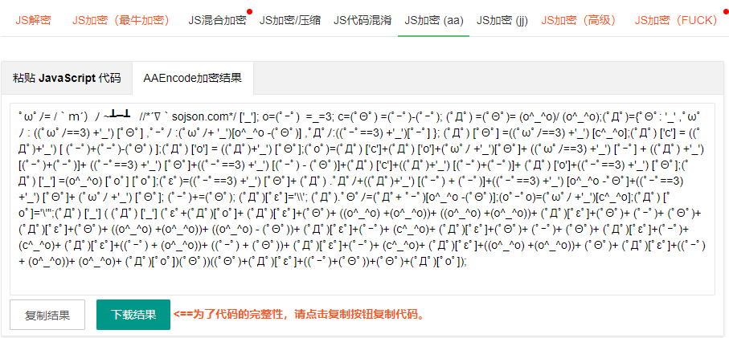
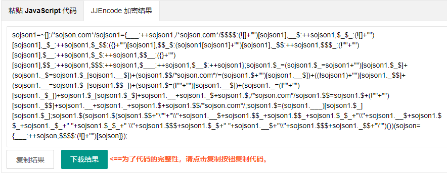
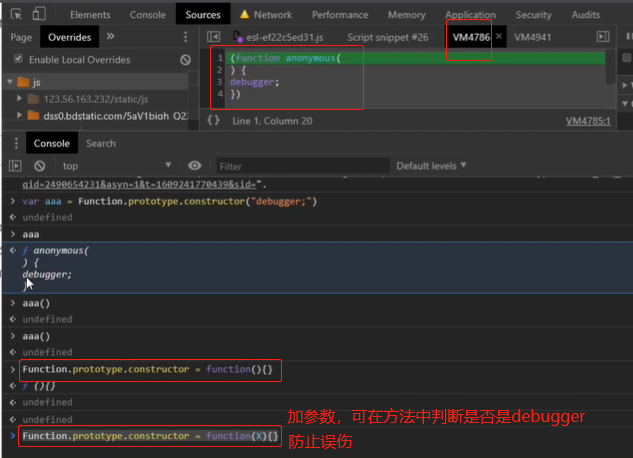
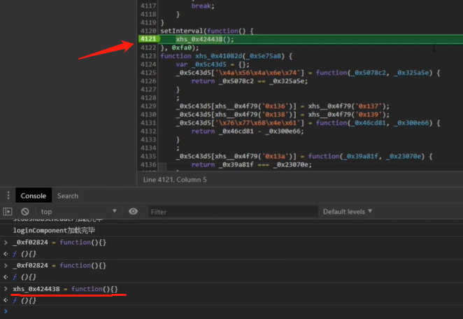

### 一、浏览器

​	先勾选下两项：


​	控制台打断点进入调试后，可选中代码，鼠标移上去可查看结果，如下图：



### 二、浏览器断点

- 【参考】https://www.bilibili.com/video/BV1Kh411r7uR?p=8&spm_id_from=pageDriver

​	1）DOM断点：html源码设置断点，用于用户触发某个事件

​	2）xhr断点：断住向服务器发送了的包

​		【注意】：点击会触发断点（有时使用刷新页面不会触发，有时又会）

​		首先类型是xhr:	

​		复制url上的关键的、不变的字段到 `XHR/fetch Breakpoints` 处，再次请求包含此字段的url就会被断住：


	

​	3）自定义代码调式断点

​	4）代码中的断点：在源码中需要打断点的地方写入语句： `debugger;`

​	5）异常捕获断点：

​		a. 可以输出代码中 `try catch` 中的异常



​		b. 可以跳过出现异常的语句（比如缺少某个模块环境）

​		首先将上图中的 `Pause on caught exceptions` 勾上；然后将报错的语句上打上断点；右键断点，如下图 —》编辑 —》输入`false` —》 回车；再刷新页面，可看到此语句不再报错     	

​	6）全局事件断点：在执行某个事件时给它断住




### 三、方法栈

栈，先调用的方法在下边，后调用的方法在上边


### 四、加密方式

- 经常使用的加密算法: Base64、DES、3DES、RC4、AES，RSA等;
- 1）Base64加密
    - 特点：由 ‘A-Z、a-z、0-9、+、_、=’ 组成；一般是 1 个或2个 '=' 结尾；是一种编码，可直接还原成明文
        - 例如: `bmV0ZHolNDBzaW5hLmNvbQ=`
- 2）对称加密：加密和解密的秘钥使用的是同一个
    - des，3des，aes
- 3）非对称加密：需要两个密钥：公钥和私钥
    - rsa
      - js中使用rsa加密的步骤（其中，只有`new`关键字不会变）：
        - new一个rsa对象
        - 设置公钥setPublicKey
        - 加密encrypt
- 4）对称加密和非对称加密，可将字符串加密成16进制或者Base64
    - 16进制：由 ‘0-9、a-f’或者字母大写 组成（有32、48、64）
    - base64：见上边
- 5）不可逆加密：
    - md5系列：md5、md2、md4、带密码的md5（hmac）
        - 特点：
            - md5长度：16位、32位、40位。其中，同一个字串加密后的16位密文包含在32位密文中
            - 由 ‘0-9、a-f’或者字母大写 组成的16进制
        - 需要熟记 123456 的md5值（用作调试看是什么加密）（记开头几位就行）
            - 16位md5：`49ba59abbe56e057`
            - 32位md5：`e10adc3949ba59abbe56e057f20f883e`
    - SHA系列：sha1（40位）、sha256（64位）、sha512（128位）
        - 特点：
            - 由 ‘0-9、a-f’或者字母大写 组成的16进制
        - 需要熟记 123456 的sha值（用作调试看是什么加密）（记开头几位就行）
            - sha1（40位）：`7c4a8d09ca3762af61e59520943dc26494f8941b`
            - sha256（64位）：`8d969eef6ecad3c29a3a629280e686cf0c3f5d5a86aff3ca12020c923adc6c92`
            - sha512（128位）：`ba3253876aed6bc22d4a6ff53d8406c6ad864195ed144ab5c87621b6c233b548baeae6956df346ec8c17f5ea10f35ee3cbc514797ed7ddd3145464e2a0bab413`
- 6）加密模式:ECB、CBC、CFB、OFB等;
- 7）填充模式:NoPadding、PKCS1Padding、PKCS5Padding、PKCS7Padding

### 五、如何js逆向（一些经验）

- 【参考】https://www.bilibili.com/video/BV1Kh411r7uR?p=11&spm_id_from=pageDriver
- 搜关键字：
    - 参数名、挨着此参数的其他参数（相邻参数在源码中可能不会相隔太远）
    - 加密方法名
    - 若大概率为md5加密：
      - 搜：`123456789`或者 `abcdef`（md5的默认key是 `0123456789abcdef`）
      - 搜：`1732584193` 或者 `271733879` 或者 `1732584197` 或者 `271733878` （md5有一些魔法值，没有实际意义，但删了又会报错）
- 扣出关键js代码运行
    - 扣出的js代码改动越少越好
- 如下图：（闭包问题）遇到连续定义并用多个逗号分开的，又想要调用变量以及变量中的方法，可做如下修改：
    - 将某个语句前的逗号改为var声明
    - 加入全局变量： `window.zhiyuan = utils;`
    - 那么在运行代码后，可直接调用全局变量
    - 为什么要这样做：因为有些闭包，外部无法访问内部的变量（让局部变全局，方便调试）
    

### 六、js混淆

【参考】https://www.bilibili.com/video/BV1Kh411r7uR?p=14&spm_id_from=pageDriver

#### 1、eval混淆

​	1）混淆常量的名和值

​	2）混淆代码执行流程

​	`eval()`：可执行js代码（自带一个VM虚拟机），将js代码加密后放入其中，起到混淆作用，如下图：

​	

#### 2、aa 与 jj 与 FUCK 加密混淆

一般是对js代码加密。

1）aa加密：JS默认支持Unicode，那么就支持全球所有的语言，那么就可以用其它语言的字符做变量，就会出现看着像 `O` 但不是 `o`，看着像 `0` 但不是 `0`，看着像 `p` 但不是 `p`

【在线js加密工具】https://www.sojson.com/aaencode.html

如下，将 `var a = 1;` 进行 aa 加密：



2）jj 加密：将 `var a = 1;` 进行 jj 加密：



3、FUCK加密：将 `var a = 1;` 进行 FUCK 加密：


### 七、伪造浏览器环境

【参考】https://www.bilibili.com/video/BV1Kh411r7uR?p=16&spm_id_from=pageDriver	

#### 1、浏览器简介（DOM、BOM与 JS引擎 的关系）

​	1）浏览器组成：一个浏览器包含DOM、BOM、JS引擎。

- DOM：文档对象，允许程序和脚本动态地访问、更新文档的内容、结构和样式

- BOM：（Broswer Object Model）浏览器自己实现的一些类：window、location、navigator、history等，用来进行与浏览器相关的一些操作。
  - window：一般用于调用Global对象
  - location：提供了与当前窗口中加载的文档有关的信息
  - navigator：主要用来获取浏览器的属性，区分浏览器类型
  - history：history 对象保存着用户上网的历史记录
- JS引擎：即js的解释器，有谷歌v8、微软查克拉、quickjs

​	2）关系

​		DOM、BOM都是js对象；

​		所有js引擎都有一个功能：可以给js 添加/删除 任意对象，或者关联本地代码

​	3）es5 与 es6：形成JS基础的标准化脚本语言

​		【官网】https://developer.mozilla.org/zh-CN/docs/Web/JavaScript

​	另外，浏览器一般都实现了常见的加密算法：如btoa、AES、DES、MD5等。

#### 2、构造浏览器环境

1）为什么要构造：

​	浏览能执行js代码是因为有js引擎，但是在其它地方（比如fiddler）没有引擎；

​	浏览器实现的对象（比如document）是只读属性，在其它地方没有这些对象（如`document.getElementsByTagName('h1')`），无法执行;

​	网站太复杂，扣不出js代码，通过伪造浏览器环境来解决。

2）怎么伪造：

​	全部伪造：window、location、navigator、history等。如Python中的jsdom、nodejs，但与真正的浏览器肯定有不同的地方，就会被检测出来；

​	给指定的网站伪造：如何知道网站检测了什么（执行js需要哪些环境模块）？通过调试、异常捕获、本地环境运行看报错。

### 八、浏览器反调试（一些经验）

【参考】https://www.bilibili.com/video/BV1Kh411r7uR?p=17&spm_id_from=pageDriver

反调试：阻挠你进行调试

1、检测是否在调试

- 键盘监听（按下F12）
- 检测浏览器内外高度的差值（浏览器打开调试工具会减小内高）
- 检测开发者工具变量是否为true
- 检测 `console.log()` 调用的次数
- 利用代码执行的时间差（调试会打断点，那么断点之后的代码会在我们点击单步调试后才会运行，会隔一段时间）
- 检测栈的层数 `func_name.caller`：可以检测是谁调用的我
- 利用`tostring` 检测行为，然后将你引向错误的逻辑。如下图，在调试时，将鼠标放到方法上，就调用了tostring

​	

2、反调试分类

- 显性（能感知到的）

  - debugger：按F12后会调用 debugger语句，应对方法：

    - 虚拟机（debugger在虚拟机文件中）

      - 因为是在虚拟机中，所以源码中会调用`eval()`或者`Function`

      - `Function` 的处理一般是让其等于一个空函数，让其不执行，如下图（具体做法见参考链接 `0:35:00` 左右）【属于hook内容】

        

        加参数判断语句：

        ```js
        var aaa = Function.prototype.constructor;
        Function.prototype.constructor = function(x){
            if(x!='debugger'){
               	//为什么要这样返回
                //因为源码一般为 Function.prototype.constructor('debugger')
                //所以要根据源码来写
                return aaa(x);
            }
            return function(){}; //要返回一个函数
        }
        ```

        

      - 此方法可以让某个方法不执行（例如不执行 ‘让你进入debugger’ 的方法），见下图：

        

      - `eval()` 同理

    - 非虚拟机：

      - 将 `debugger` 那句代码加断点，然后编辑其值为`false`（参考第二点 ‘浏览器断点’ ），不执行此句代码。
      - 直接替换代码：
        - 使用fiddler代理替换代码，具体做法见参考链接 `0:30:00` 左右

  - 死循环（卡死）：按F12后调用死循环。如循环语句、无限递归、两个方法互调、定时器、打开新页面、写你的历史记录

- 隐形（暗桩）

  - 引向错误的逻辑
    - 解决方法：可以hook住堆栈，然后进入浏览器F12查看堆栈，进行对比

### 九、调试技巧（一些经验）

1、下断点的位置：初始值的位置、循环的位置、返回的位置、函数的开头与结尾

2、在对象的属性中见到 `setPublic`（也会换成其他名字）,  意为设置公钥，那么有公钥的，大概率是 RSA 加密

- js中使用rsa加密的步骤（其中，只有`new`关键字不会变）：

  - new一个rsa对象

  - 设置公钥setPublicKey

  - 加密encrypt


3、对于某一句代码，想看它每次执行的结果是否一致，可将其复制到控制台输出

4、遇到加密算法，有两个思路：1）扣出加密函数，直接运行；2）找明文、找密钥，再手动实现