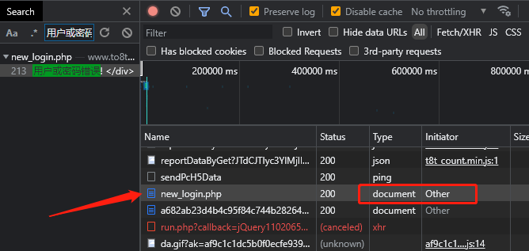
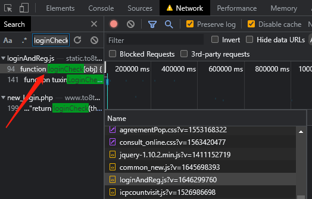
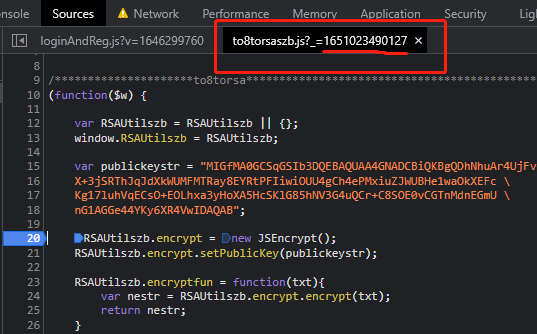
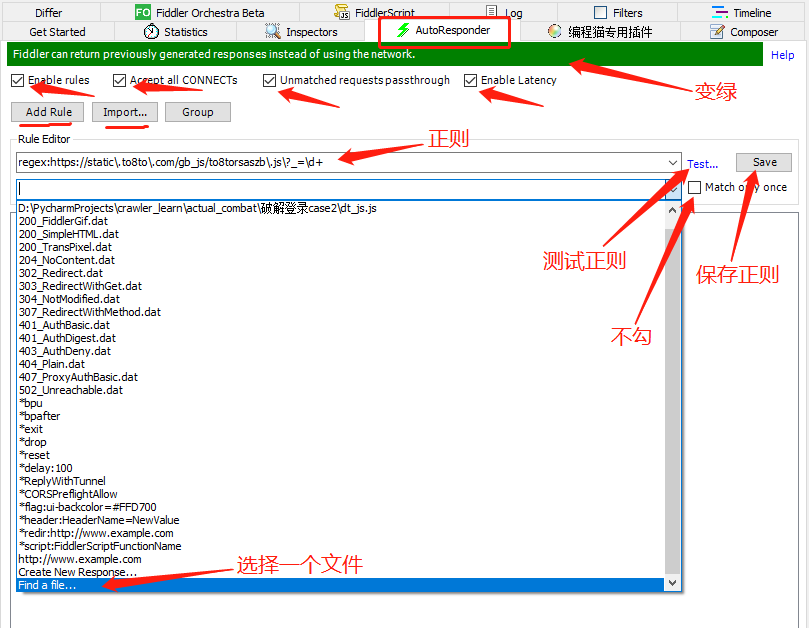
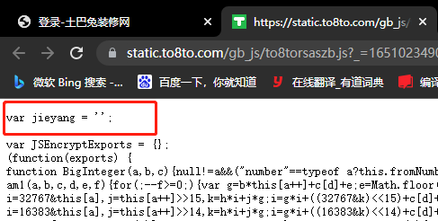
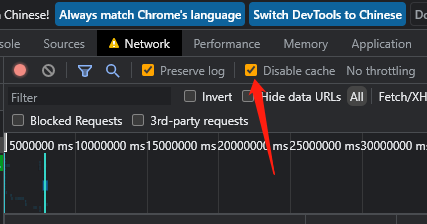

【视频教程】阿里云盘：爬虫 > 志远 > 一期 > 6.5 js调试_初试本地联调  
网站：https://www.to8to.com/new_login.php

### 破解此网站的步骤：

### 1、定位

​	随便登录，有 '用户或密码错误' 提示，可直接在开发者工具中搜，大概率可定位到发送数据的API，如下图

​		

​	这个包，提交了两个加密参数 val、password；并且发现，Type 为 document、Initiator 为 Other，这种一般在网页源码中搜这个url。如下图:

​	发现是form表单提交的数据，并调用了 `return loginCheck(this)`，然后直接搜 loginCheck，定位到源码中的位置，如下图：

​								

​	然后定位到下图中的位置，但是发现这个js文件是动态生成的（**url后面是时间戳**），断点没用：

​								

### 2、动态js的处理——本地联调

使用 Fiddler 中的 AutoResponder 工具；

AutoResponder 的作用：根据设置的规则，匹配url，拦截符合规则的url包，将其替换为本地文件，并发给浏览器

使用步骤：

- 1）将动态js文件的代码保存到本地js文件（并在开头写一句辨识代码）：`./dt_js.js`

- 2）打开 Fiddler，选择 AutoResponder ，进行如下配置

  

  正则：写那个动态js的正则；

  文件：选择上一步的本地js文件

- 3）将网站的动态js在新的标签页中打开，然后刷新此新的标签页，看是否是我们本地的js代码

  

​								

​		若没有替换成功，可能是浏览器缓存的问题，需要清一下缓存，有两种方法：打开新的无痕窗口；或者勾选下图中的选项：

​								

- 4）若替换成功，现在刷新网站，再定位到这个动态js文件中，可看到已经替换为我们本地的js代码。现在就可以在我们本地的代码中写上`debugger;`，或者其他操作