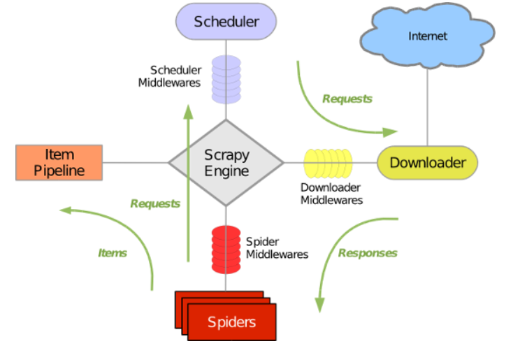

- 目录
    - 使用流程
    - 日志log
    - 持久化存储
    - scrapy五大核心组件简介
    - 请求传参（在持久化存储时在不同方法中传递item对象）
    - 图片数据爬取之ImagesPipeline
    - scrapy中间件
    - 基于CrawlSpider的全站数据爬取
    - 分布式爬虫
    - 增量式爬虫


### 使用流程
- 1、创建工程：
    - 进入到某路径下执行`scrapy startproject ProName`
- 2、进入工程目录：
    - `cd ProName`
- 3、创建爬虫文件：
    - `scrapy genspider spiderName www.xxx.com`
- 【设置setting.py】
    - `ROBOTSTXT_OBEY = False`
        - 先更改为不遵守
    - 日志log
    - 设置请求头
- 4、 编写相关操作代码
- 【5、可选：持久化存储】
- 6、 执行工程：
    - `scrapy crawl spiderName [--nolog]`
  
### 日志log
- 控制输出信息
  - 在执行工程时会输出log信息，可加--nolog让其不输出（不推荐，因为看不到错误信息）
  - 可在settings.py文件中添加属性 `LOG_LEVEL = 'ERROR'` 来实现 （推荐）
    - Scrapy提供5层logging级别:  
        CRITICAL - 严重错误(critical)  
        ERROR - 一般错误(regular errors)  
        WARNING - 警告信息(warning messages)  
        INFO - 一般信息(informational messages)  
        DEBUG - 调试信息(debugging messages)
      
### 持久化存储
- 【代码在 learn_scrapy 中】
- 基于终端指令的持久化存储
    - 要求：只可以将parse方法的可迭代类型对象（通常为列表or字典）返回值写入本地的文本文件中
    - 执行终端指令：
        - scrapy crawl 爬虫名称 -o xxx.json
        - scrapy crawl 爬虫名称 -o xxx.xml
        - scrapy crawl 爬虫名称 -o xxx.csv
- 基于管道的持久化存储
    - 认识两个文件
        - items.py：数据结构模板文件。定义数据属性。
        - pipelines.py：管道文件。接收数据（items），进行持久化操作
    - 持久化流程  
        - 1、爬虫文件爬取到数据后，需要将数据封装到items对象中。  
            - items.py中添加：  
                ```
                author = scrapy.Field()
                content = scrapy.Field()
                ```  
            - 爬虫文件first.py中封装：  
                ```
                from learn_scrapy.items import LearnScrapyItem
                item = LearnScrapyItem()
                item['author'] = author
                item['content'] = content
                ```  
        - 2、使用yield关键字将items对象提交给pipelines管道进行持久化操作。  
            - 爬虫文件中：`yield item`  
        - 3、在管道文件中的 process_item() 方法中接收爬虫文件提交过来的item对象，然后编写持久化存储的代码将item对象中存储的数据进行持久化存储  
        - 4、settings.py配置文件中开启管道
            ```python
            - ITEM_PIPELINES = {
                    # 300表示的是优先级，数值越小优先级越高
                   'learn_scrapy.pipelines.LearnScrapyPipeline': 300,
                }
            ```
    
    - 【问题】如果最终需要将爬取到的数据值一份存储到磁盘文件，一份存储到数据库中，则应该如何操作scrapy？
        - 【答】可以再定制一个管道类：  
            ```python
            class LearnScrapyItem_db:
              def process_item(self, item, spider):
                  #持久化操作代码 （方式1：写入数据库）
                  return item
            ```  
          在settings.py开启管道操作代码为；  
            ```python
            ITEM_PIPELINES = {
                'doublekill.pipelines.DoublekillPipeline': 200,
                'doublekill.pipelines.DoublekillPipeline_db': 300,
            }
            上面字典中的键值表示的是即将被启用执行的管道文件和其执行的优先级(值越小越先执行)
            ```
          
    - 【问题】有多个管道类，那么 yield item 先提交给哪个管道类呢？后续的管道类怎么接收这个item呢？
        - 【答】会先提交给优先级最高的管道类
            ```python
            def process_item(self, item, spider):
                  #持久化操作代码 （方式1：写入数据库）
                  return item
            # 【return item 会将item传递给下一个即将被执行的管道类】
            ```
            
          
### scrapy五大核心组件简介

- 引擎(Scrapy)
    - 用来处理整个系统的数据流处理, 触发事务(框架核心)
- 调度器(Scheduler)
    - 用来接受引擎发过来的请求, 压入队列中, 并在引擎再次请求的时候返回. 可以想像成一个URL（抓取网页的网址或者说是链接）的优先队列, 由它来决定下一个要抓取的网址是什么, 
    - 同时去除重复的网址
- 下载器(Downloader)
    - 用于下载网页内容, 并将网页内容返回给蜘蛛(Scrapy下载器是建立在twisted这个高效的异步模型上的)
- 爬虫(Spiders)
    - 爬虫是主要干活的, 用于从特定的网页中提取自己需要的信息, 即所谓的实体(Item)。用户也可以从中提取出链接,让Scrapy继续抓取下一个页面
- 项目管道(Pipeline)
    - 负责处理爬虫从网页中抽取的实体，主要的功能是持久化实体、验证实体的有效性、清除不需要的信息。当页面被爬虫解析后，将被发送到项目管道，并经过几个特定的次序处理数据。
    

### 请求传参（在持久化存储时在不同方法中传递item对象）
- 【all_page_crawl文件中的示例】
- 使用场景：列表列和详情页均有需要解析的数据（一条数据的各项不在同一个页面中），且不在同一个方法中，在持久化存储时不能提交多次item，所以用到meta属性来传递上一个方法的item对象给下一个方法
- 【问题】为什么不用全局变量呢？这样就可以不用传参了啊
    - 【答】可能这里是为了演示有这个功能吧
    

### 图片数据爬取之ImagesPipeline
- ImagesPipeline使用流程
    - 在爬虫文件中获取图片的src，并提交item给管道类【同上面持久化存储的提交】
    - 在配置文件中进行如下配置：
        - IMAGES_STORE = './imgs'  表示最终图片存储的目录  
    - 在管道类中继承ImagesPipeline父类，并重写父类方法
        ```python
        from scrapy.pipelines.images import ImagesPipeline
        #ImagesPipeline专门用于文件下载的管道类，下载过程支持异步和多线程
        class ImgPipeLine(ImagesPipeline):
          #对item中的图片进行请求操作
          def get_media_requests(self, item, info):
              yield scrapy.Request(item['src'])
          #定制图片的名称
          def file_path(self, request, response=None, info=None):
              url = request.url
              file_name = url.split('/')[-1]
              return file_name
          def item_completed(self, results, item, info):
              return item  #该返回值会传递给下一个即将被执行的管道类
        ```         
      
### scrapy中间件
- 下载中间件（Downloader Middlewares）【selenium的使用】
    - 位置：位于scrapy引擎和下载器之间的一层组件。
    - 作用：我们主要使用下载中间件处理请求，一般会对请求设置随机的User-Agent ，设置随机的代理。目的在于防止爬取网站的反爬虫策略。
        - （1）引擎将请求传递给下载器过程中， 下载中间件可以对请求进行一系列处理。比如设置请求的 User-Agent，设置代理等
        - （2）在下载器完成将Response传递给引擎中，下载中间件可以对响应进行一系列处理。比如进行gzip解压等。
    - 1、'拦截请求'的使用步骤（crawl_wangyi_news项目文件下）：
        - 在middlewares.py文件中，配置ScrapyLearnDownloaderMiddleware类
            - 在process_request(),process_exception()方法中设置UA、代理
        - 在配置文件中开启下载中间件
            - DOWNLOADER_MIDDLEWARES = {
                   'scrapy_learn.middlewares.ScrapyLearnDownloaderMiddleware': 543,
                }
              
    - 【**完整项目01**】爬取网易新闻数据【包含多板块多url、传参item对象、selenium的使用、动态数据、中间件】
        - 此项目有动态数据，这里用到’下载中间件‘拦截响应对象，并使用selenium重新请求动态数据
    - 2、'拦截响应'的使用步骤（crawl_wangyi_news项目文件下）【selenium的使用】
        - 在middlewares.py文件中，配置ScrapyLearnDownloaderMiddleware类
            - 在process_response()方法中设置拦截响应数据后的处理
            - 在配置文件中开启下载中间件、开启管道
        - 在spider777爬虫文件下编写爬虫程序
    
### 基于CrawlSpider的全站数据爬取
- 【代码在 crawlSpider_learn 文件中】
- CrawlSpider类：Spider的一个子类
- 全站数据爬取的方式：
    - 基于Spider父类：手动请求（编写request代码）
    - 基于CrawlSpider父类
- CrawlSpider类的使用：
    - 在创建爬虫文件时使用如下命令：
        - `scrapy genspider -t crawl spiderName www.xxx.com`
    - 编写代码
        - 可编写多个规则解析器，解析不同链接，不同数据
    - 提交item：
        - 因为是继承CrawlSpider父类，所以请求传参不可用（需继承Spider父类）
        - 可以分别存到两个item中
            - 方法：在item.py中添加DetailItem类；在爬虫文件中分别提交各类的item
        - 【问题】如何在管道文件中区分是哪个类的item？
        - 【答】  if item.__class__.__name__ == 'DetailItem':
                    print('DetailItem类中的item')
    - 开启管道 
    
### 分布式爬虫
- 【代码在 distributed_crawl 文件中】
- 如何实现？
    - 安装scrapy_redis包
- 作用：
    - 可以给scrapy提供可以被共享的调度器和管道
- 使用实例：
    - 本实例基于CrawlSpider类实现
    - 爬虫文件中【代码基于crawlSpider_learn文件中的】：
        - 导入 `from scrapy_redis.spiders import RedisCrawlSpider`
        - 将`allowed_domains`、`start_urls`属性注释掉
        - 添加新属性 `redis_key = 'sun'`，可以被共享的调度器队列的名称
        - 将当前爬虫类的父类修改成 `RedisCrawlSpider`
    - 修改配置文件settings.py
        - 指定使用可以被共享的管道：  
            ```python
            ITEM_PIPELINES = {
                'scrapy_redis.pipelines.RedisPipeline': 400,
            }
            ```
        - 指定调度器  
            ```python
            # 增加一个去重容器类的配置，作用：使用Redis的set集合来存储请求的指纹数据，从而实现请求去重的持久化
            DUPEFILTER_CLASS = 'scrapy_redis.dupefilter.RFPDupeFilter'
            # 使用scrapy_redis组件自己的调度器
            SCHEDULER = 'scrapy_redis.scheduler.Scheduler'
            # 配置调度器是否要持久化，也就是当爬虫结束时，要不要清空Redis中请求队列和去重指纹的set
            # 例如某一台机子宕机了，这台机子爬过的数据就可以不用再爬了
            SCHEDULER_PERSIST = True
            ```
        - 指定redis【数据存放位置】（不指定的话默认是存放在本机）
            ```python
            DEDIS_HOST = 'redis服务的ip地址'
            REDIS_PORT = 6379
            ```
    - redis相关操作
        - win10安装
            - 网上有安装包
            - 进入到安装目录下，执行 `redis-server redis.windows.conf`，可看到是否安装成功
            - ‘任务管理器’里的‘服务’下可看到Redis服务
        - 常用的Redis服务命令
            - 卸载服务：redis-server  --service-uninstall
            - 开启服务：redis-server  --service-start
            - 停止服务：redis-server  --service-stop
        - 配置redis的配置文件
            - linux或者mac：redis.conf
            - windows: redis.windows.conf
            - 打开配置文件进行如下修改：
                - 注释掉默认绑定的主机地址【代表只能接受本机的访问】：`bind 127.0.0.1`
                    - 但是执行配置文件时会报错
                    - 不注释，将 `bind 127.0.0.1` 改为 `bind 0.0.0.0`，代表任何机器都可以访问
                - 关闭保护模式【若开启，其他客户端不能往redis中写入数据】：`protected-mode no`
        - 命令行执行 `redis-server redis.windows.conf`
        - 启动客户端【当前终端已被占用，打开另一个终端】：`redis-cli`
            - 客户端常用命令
                - 向调度器的队列中放入一个起始的: `urllpush 调度器名称 url`
                - 查看分布式相关信息：`key *` (spiderName:items中存放着爬取的数据)
                - 查看爬取到的数据：`lrange spiderName:items 0 -1`  (0 -1表示所有范围)
                - 查看数据长度: `llen spiderName:items`
    - 执行工程（注意与非分布式的scrapy工程的执行命令区分）：
        - `scrapy runspider spiderName.py`
    - 向调度器的队列中放入一个起始的url：
        - 调度器的队列在redis的客户端中（在上面启动的redis客户端后输入以下命令）：
            - `lpush 调度器名称(爬虫文件中添加的redis_key) 起始url`
    - 爬取的数据存储在redis的 spiderName:item 中（在上面的redis客户端中输入命令可查看）
    
### 增量式爬虫
- 【代码在 get_update_data 文件中】
- 概念：检测网站数据更新的情况，只会爬取网站最新更新出来的数据
- 例子步骤：
    - 指定一个起始url
    - 基于CrawlSpider类获取其他页码链接
    - 基于Rule(爬虫文件中的)将其他页码链接进行请求
    - 从每一个页码对应的页面中解析出每一个详情页的url
    - 【**增量式爬虫核心**】检测电影详情页的url之前有没有请求过
        - 将爬取过的详情页url存储到redis的set数据结构中
    - 对详情页的url发起请求，解析出详情页数据
    - 进行数据的持久化存储(pipelines.py中)
        ```python
        from redis import Redis
        conn = Redis(host='127.0.0.1', port=6379)
        # 存入redis的一个列表中
        self.conn.lpush('name_of_list', data)
        ```
        
    