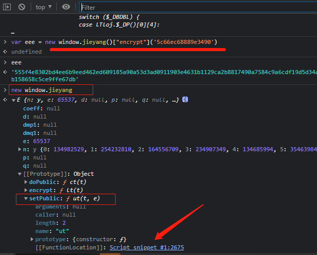
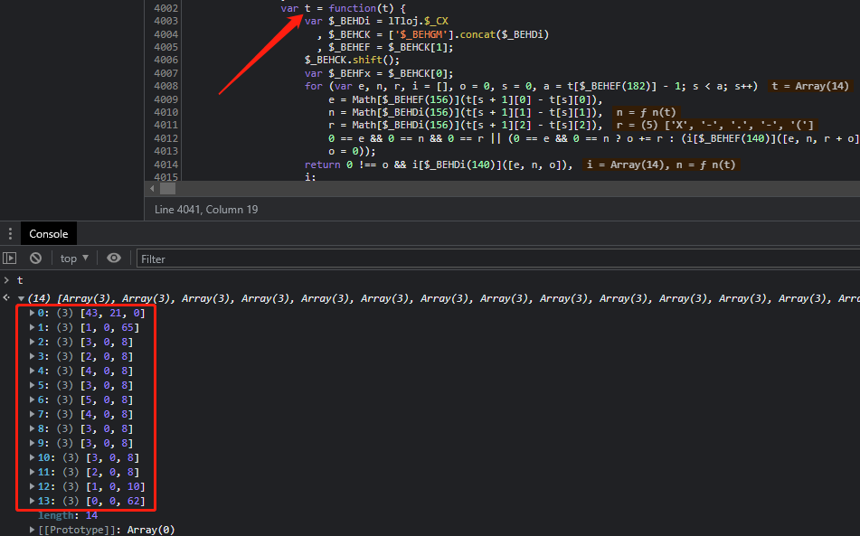
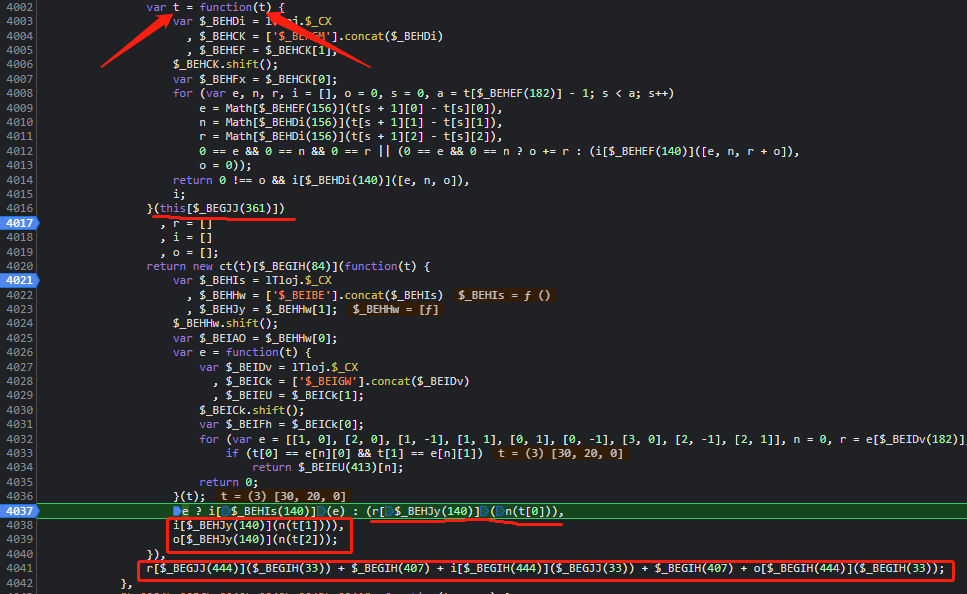
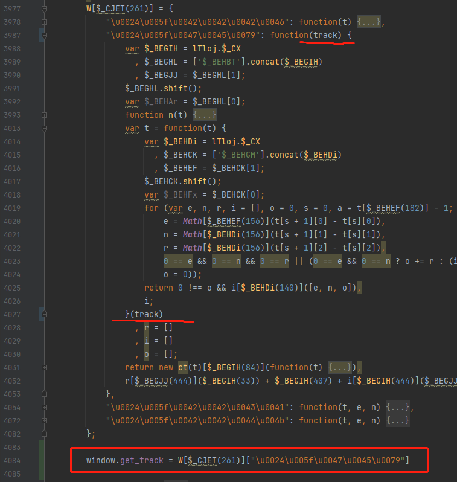

本案例是破解极验官网上的滑块dmeo：https://www.geetest.com/demo/slide-float.html  
【视频教程】https://www.bilibili.com/video/BV1Kh411r7uR?p=18&spm_id_from=pageDriver
【github上的实现】https://github.com/nmsdss/JiYan_Geetest

方法一：见100例中例58，使用selenium，修改canvas的属性值，得到原图，然后与空缺图计算像素差值，然后模拟人移动滑块  
方法二：此案例，js逆向，在源码中找出将乱码图还原的代码，找出轨迹参数

步骤：
一、抓包分析：

- 刷新网页时进行了以下请求：  
  1、请求了 register-slide?t=1648605468179，得到下面两个参数：  
         challenge: "1d01ce56a37f014960c60b7a4f040cfc"  
         gt: "019924a82c70bb123aae90d483087f94"  
  2、请求了 gettype.php?gt=， 得到点击等的位置 与 js链接  
  3、请求上一步的js链接  
  4、请求了 get.php， 提交了参数gt、challenge、w（经过了加密）  
- 点击验证按钮，进行了以下请求：  
  1、请求了 ajax.php， 提交了参数gt、challenge、w（不一样的w，经过了加密）  
  2、请求了 get.php， 提交了参数gt、challenge， 返回了图片地址（乱码的）  
- 拖动滑块验证，进行了以下请求：  
  1、请求了 ajax.php， 提交了参数gt、challenge、w（经过了加密）， 返回了 validate  
  - 分析：gt、challenge是之前就得到的，那么参数w中就包含了环境校验、轨迹  

二、调试  
目标：  
1、找到并分析 乱码原图，找到还原的代码；
- 步骤
    - 查看弹出的验证码图片为`<canvas>`，然后在 ‘Event Listen Breakpoints’ 中的 ‘Canvas’ 打断点
    - 在弹出的验证码上点击刷新验证码（因为要找到原图，那么网页上要弹出验证码图片才行啊，控制台才有这部分的源码）
    - 可先看断点处所在的文件名（大概知道这是啥文件）
    - 然后分析源码，需要注意一些关键的信息，如下图：
    

2、找到并分析 w参数 如何生成
- 步骤
  - 找到请求url，然后跟栈，找到生成w的地方
  
    - 
  
  - 发现生成w与三个变量有关（u，l，h）
  
  - 1）生成变量`u`
  
    - 发现关键代码： `var e = new X()[$_CBEEc(342)](this[$_CBEEc(742)](t));`
      - 查看值，发现其中，$_CBEEc(342) == "encrypt"，X的原型中有setPublic
      - 那么，这是加密（有setPublic设置公钥，大概率是rsa加密）
    - 先找参数 `this[$_CBEEc(742)](t)`
      - 进入 `this[$_CBEEc(742)]` 的函数中，可找到，自定义函数`random_`可得到
    - 然后找加密算法相关信息（公钥，偏移量iv等），我们进入setPublic，查看公钥key
      - 我们输出公钥key，发现长度为258，并且不会变
        - 可能是作者对加密算法做了一些手脚，自己又很难看懂，所以采用抠代码的方法
    - 抠代码
      - 当前语句 `var e = new X()[$_CBEEc(342)](this[$_CBEEc(742)](t));` 只剩下`X`不知道是怎么来的
      - 复制当前整个js文件到本地文件，搜索X出现的位置，发现都在一个自执行函数里面
        - 那么可直接执行，不报错（nice）
      - 那么可以拿到 X
        - 在控制台输出 X，发现无此变量，那么可以赋值给全局变量： `window.jieyang = X`
        - 
        - 然后在控制台就会有这个变量了
    - 复现关键代码：`var e = new X()[$_CBEEc(342)](this[$_CBEEc(742)](t));`
      - `var eee = new window.jieyang()["encrypt"](random_())`
    - 但是我们不知道生成的key值、模值iv是否与原码生成的一致（ps：在new的时候就会进入到setPublic设置公钥，可断点验证）
    - 验证是否一致
      - 原码生成的key值、模值iv在之前调试的时候已经看到了
      - 复现的代码在控制台执行后，再查看new之后设置的公钥key
        - 设置断点查看值
      - 
  
  - 2）生成变量`l`
  
    - 【https://www.bilibili.com/video/BV1Kh411r7uR?p=22】
  
    - 关键代码： `l = V[$_CAGEe(342)](gt[$_CAGEe(209)](o), r[$_CAGEe(742)]())`
      - 查看值，发现其中，
        - $_CAGEe(342) == "encrypt"
        - $_CAGEe(209) == "stringify"
        - o 是一个对象，里面有加密参数
        - `r[$_CAGEe(742)]()` 同上一步的`this[$_CBEEc(742)](t)`
  
    - 进入 `V["encrypt"]`函数中，看不懂，并且与上一步骤在同一个文件，可抠代码直接执行，得到 `V`
  
    - 观察对象 `o`，多次执行，发现里面的属性aa、rp、userresponse是动态的
  
    - 跟值aa到了下面的代码：
  
      - `l = n[$_CJJIW(1078)][$_CJJJd(1069)](n[$_CJJIW(1078)][$_CJJJd(1051)](), n[$_CJJJd(13)][$_CJJIW(1045)], n[$_CJJIW(13)][$_CJJIW(307)]);`，其中
  
        - 第一个参数是轨迹
        - 第二个参数是一个数组，请求链接可以直接得到
        - 第三个是一串数字，请求链接可以直接得到
        - 主函数 `n[$_CJJIW(1078)][$_CJJJd(1069)]`根据`l`的值以及参数的值，可以看出应该是加密函数
  
      - 跟第一个参数 `n[$_CJJIW(1078)][$_CJJJd(1051)]()`，其值为轨迹。发现一个变量t，输出t查看值，如下图
  
        
  
        - 解释：三元数组表示轨迹，三个值分别代表x，y，时间；为什么第一个值较大，后面的值很小呢？因为是存的差值（原始数据`this[$_BEGJJ(361)`没有存差值）（减小内存占用）
  
      - 下面是生成aa值的关键代码：
  
        
  
        - 解释：
          - `this[$_BEGJJ(361)]`原轨迹，`t`新轨迹（`var t = function(原轨迹)`）（对原轨迹做了一些处理）
          - `t[0]` => x，`t[1]` => y，`t[2]` => 时间
          - `n()` 加密函数
          - 最后一句代码是将r、i、o三个列表中的元素进行拼接
  
      - 关键参数我们都知道了，现在可以改写一下代码（改写this关键字）并将关键函数导出到全局变量中，手动进行调用，如下
  
        
  
    - rp的生成
  
      - 关键代码：`o[$_CAGDp(727)] = U(i[$_CAGEe(147)] + i[$_CAGEe(154)][$_CAGEe(126)](0, 32) + o[$_CAGEe(716)]);`
      - 替换后为：`o["rp"] = U(i["gt"] + i["challenge"]["slice"](0, 32) + o["passtime"]);`
        - 其中，`o["passtime"]`经过分析为，按下按钮到释放的通过时间
        - `U()`函数为加密函数，同上面，将其导出到全局变量中
  
    - userresponse的生成
  
      - 关键代码：`H(t, i[$_CAGDp(154)])`
        - 其中，`t`为原始轨迹中的最大的`x`的值；`i[$_CAGDp(154)]`为`challenge`
        - `H()`函数为加密函数，同上面，将其导出到全局变量中
  
    - 最后生成 `l = V[$_CAGEe(342)](gt[$_CAGEe(209)](o), r[$_CAGEe(742)]())`
  
      - `V[$_CAGEe(342)]`为加密函数，同上面，将其导出到全局变量中
        - 但是发现这个函数不好导
      - 换个思路，可以导 `V`

​					

