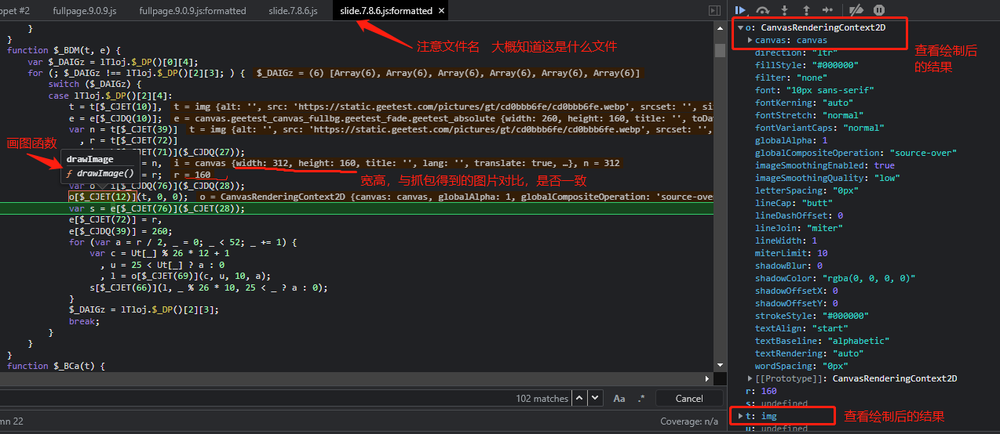

本案例是破解极验官网上的滑块dmeo：https://www.geetest.com/demo/slide-float.html  
【视频教程】https://www.bilibili.com/video/BV1Kh411r7uR?p=18&spm_id_from=pageDriver

方法一：见100例中例58，使用selenium，修改canvas的属性值，得到原图，然后与空缺图计算像素差值，然后模拟人移动滑块  
方法二：此案例，js逆向，在源码中找出将乱码图还原的代码，找出轨迹参数

步骤：
一、抓包分析：

- 刷新网页时进行了以下请求：  
  1、请求了 register-slide?t=1648605468179，得到下面两个参数：  
         challenge: "1d01ce56a37f014960c60b7a4f040cfc"  
         gt: "019924a82c70bb123aae90d483087f94"  
  2、请求了 gettype.php?gt=， 得到点击等的位置 与 js链接  
  3、请求上一步的js链接  
  4、请求了 get.php， 提交了参数gt、challenge、w（经过了加密）  
- 点击验证按钮，进行了以下请求：  
  1、请求了 ajax.php， 提交了参数gt、challenge、w（不一样的w，经过了加密）  
  2、请求了 get.php， 提交了参数gt、challenge， 返回了图片地址（乱码的）  
- 拖动滑块验证，进行了以下请求：  
  1、请求了 ajax.php， 提交了参数gt、challenge、w（经过了加密）， 返回了 validate  
  - 分析：gt、challenge是之前就得到的，那么参数w中就包含了环境校验、轨迹  

二、调试  
目标：  
1、找到并分析 乱码原图，找到还原的代码；
- 步骤
    - 查看弹出的验证码图片为<canvas>，然后在 ‘Event Listen Breakpoints’ 中的 ‘Canvas’ 打断点
    - 在弹出的验证码上点击刷新验证码（因为要找到原图，那么网页上要弹出验证码图片才行啊，控制台才有这部分的源码）
    - 可先看断点处所在的文件名（大概知道这是啥文件）
    - 然后分析源码，需要注意一些关键的信息，如下图：
    

2、找到并分析 w参数 如何生成